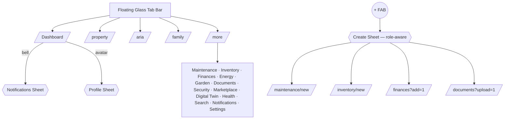
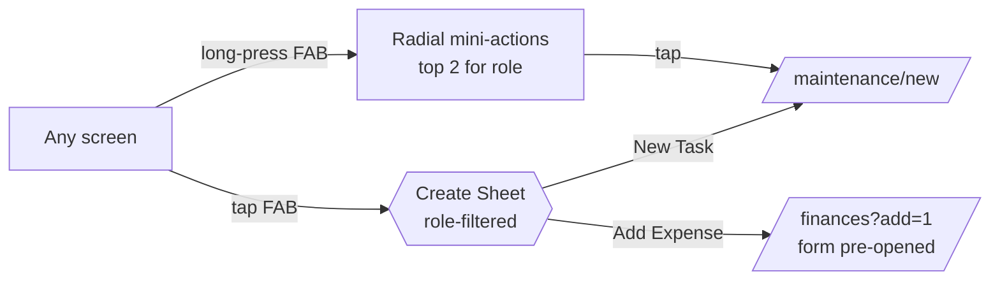
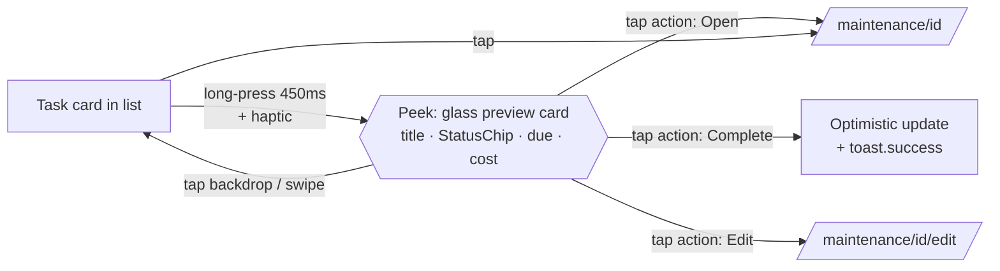
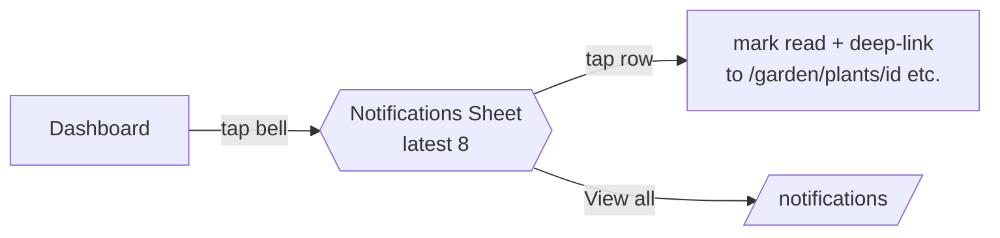
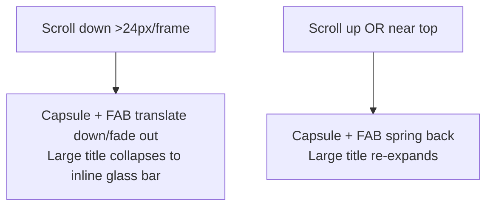

# PRV HOUSE — Mobile UX Architecture

> **Status: PROPOSAL — awaiting approval. No implementation has been done.**
>
> Direction: Apple-inspired floating glass navigation, large-title headers,
> peek & pop interactions — implemented entirely **inside** the existing
> GLASS OS™ design system and component library. No new design language.

---

## 1. Mobile UX Architecture

### 1.1 Principles

| Principle | Meaning in PRV |
|---|---|
| One visual language | Every surface is built from the existing `glass-*` utilities (`glass-whisper → light → standard → heavy → opaque → frosted`) and existing tokens. New components extend, never fork. |
| Thumb-first | All primary interactions live in the bottom 40% of the viewport: floating tab bar, FAB, bottom sheets. Top of screen is read-only context (titles, status). |
| Depth = hierarchy | Z-layers map to glass intensity. The further a surface floats above the page, the heavier its glass. |
| Progressive disclosure | Peek (long-press preview) → Sheet (secondary flow) → Page (primary flow). A user should rarely need a full navigation to act. |
| Role-aware | Every actionable surface consults `lib/permissions.ts` (`getCapabilities(role)`). Users never see actions they cannot perform. |

### 1.2 Depth / Z-Layer model

```
z-[70]  Confirm dialogs            glass-opaque   + glass-frosted backdrop
z-[68]  Toasts                     glass-heavy
z-[65]  Context menus / Peek cards glass-opaque   + glass-frosted backdrop
z-[60]  Bottom sheets              glass-opaque   + glass-frosted backdrop
z-[50]  FAB                        bg-primary     + shadow-glow-home
z-[30]  Floating tab bar (NEW)     glass-heavy    + shadow-4, capsule
z-[22]  Sticky headers             glass-standard → transparent (NEW: scroll-aware)
z-[10]  Page content               cards: glass-light / glass-standard
z-[0]   LPBE living background
```

Rule: a surface may only blur surfaces *below* it. Backdrop blur is always
`glass-frosted` (already themed for dark/light).

### 1.3 Interaction model

| Gesture | Result | Component |
|---|---|---|
| Tap | Navigate / primary action | existing |
| Long-press (450 ms) | **Peek preview card + quick actions** | `ContextMenu` (extended with `preview` slot) |
| Swipe down on sheet | Dismiss | `BottomSheet` (exists) |
| Swipe right from edge | Back navigation | new `useEdgeSwipeBack()` hook → `router.back()` |
| Pull down on lists | Refresh | new `PullToRefresh` wrapper → `router.refresh()` |
| Scroll | Header collapses large title → inline title | `LargeTitleHeader` (evolved `PageHeader`) |

All animations use the existing spring tokens
(`ease-spring-out: cubic-bezier(0.34, 1.56, 0.64, 1)`, `animate-slide-up`,
`animate-scale-in`) — no new timing functions.

---

## 2. Mobile Navigation Architecture

### 2.1 Floating Glass Tab Bar (replaces full-width `BottomTabBar`)

Reference: capsule nav (IMG_5922). Current bar is a full-width `glass-opaque`
strip docked to the screen edge. Proposed:

```
        ┌──────────────────────────────────────┐
        │  ⌂      ⌂̇      ✦      ♥      ⊞       │   ← capsule, floats 12px above safe-area
        └──────────────────────────────────────┘
   Home   Property   ARIA   Family   More
```

Specification:

- Container: `fixed bottom-[calc(env(safe-area-inset-bottom)+12px)] left-4 right-4`
  (max-width capped + centered on tablets), `rounded-full`, `glass-heavy`,
  `shadow-4`, 1px `border-white/10` highlight on the top edge
  (premium rim light).
- Active state: a **sliding glass pill** behind the active icon — the exact
  thumb mechanic already shipped in `SegmentedControl` (measured via refs,
  `transition-all duration-normal ease-spring-out`). Active icon gets its
  module color + label; inactive icons 50% opacity, no label.
- ARIA center tab keeps its glow treatment (`shadow-glow-aria`) but sits
  *inside* the capsule (no more notch overflow) to preserve the clean capsule
  silhouette.
- Badge: unchanged (`Badge variant="danger"` on More).
- Hide-on-scroll: translates down + fades on scroll-down, springs back on
  scroll-up or when near top (shared `useScrollDirection()` hook with the
  header).
- Desktop (`md:`+): unchanged `SidebarNav`. The capsule is mobile-only,
  exactly like today's bar.

### 2.2 FAB placement relative to the capsule

FAB moves from `bottom-[96px] right-4` to **right-aligned, vertically
centered 16px above the capsule**. When the capsule hides on scroll, the FAB
docks down with it (one shared transform). FAB and capsule never overlap
content interaction zones.

### 2.3 Apple-style headers (`LargeTitleHeader`, evolved from `PageHeader`)

Reference: IMG_5937 (large title + circular minimal controls).

```
┌────────────────────────────────────────┐
│ (←)                              (⋯)(+)│  ← inline bar: 44px circular glass-light buttons
│                                        │
│ Maintenance                            │  ← large title 28px/bold, collapses on scroll
│ Villa Aurora                           │  ← subtitle 13px muted
└────────────────────────────────────────┘
```

- At rest: transparent background, large title in content flow.
- After ~48px scroll: title shrinks into the inline bar, bar gains
  `glass-standard` + hairline border (current `PageHeader` appearance —
  meaning the *collapsed* state is literally today's header; zero visual
  drift for existing screens).
- Controls: max two trailing circular buttons (primary action `+`, overflow
  `⋯` opening a BottomSheet). Existing `action` prop API is preserved;
  `PageHeader` becomes a thin alias so all 30+ call sites keep working.

### 2.4 Navigation map (unchanged routes, new chrome)



---

## 3. Component Mapping

| Spec concept | Existing component | Action |
|---|---|---|
| Floating glass nav | `layout/bottom-tab-bar.tsx` | **Evolve** → capsule geometry, sliding pill active state, hide-on-scroll. Same props (`unreadCount`), same tab config. |
| FAB + expandable quick actions | `layout/quick-actions-fab.tsx` | **Evolve** → reposition above capsule; optional radial mini-actions on long-press (top-2 role actions) in addition to the Create sheet on tap. |
| Apple-style top nav | `layout/page-header.tsx` | **Evolve** → `LargeTitleHeader` with collapse behavior; `PageHeader` kept as compatible alias. |
| Liquid glass surfaces | `globals.css` `.glass-*` + `tailwind.config.ts` shadows | **Reuse as-is.** One addition: `--glass-rim` top-edge highlight variable for floating surfaces (capsule, FAB, sheets). |
| Bottom sheets | `ui/bottom-sheet.tsx` | **Reuse as-is** (already grabber/swipe/spring/heights). |
| Peek & Pop | `ui/context-menu.tsx` | **Extend** → optional `preview` ReactNode rendered as a glass card above the action list (long-press shows preview + actions, like IMG_5938). Add `PeekCard` presets for Task / Plant / InventoryItem / Document. |
| Context menus | `ui/context-menu.tsx` | Already shipped; adopt on remaining list cards (documents, contacts, records). |
| Status chips | `ui/chip.tsx` | Reuse as-is inside peek cards. |
| Segmented controls | `ui/segmented-control.tsx` | Reuse; its thumb-measurement logic is extracted to a shared `useSlidingThumb()` hook consumed by the tab bar. |
| Toasts / Confirms | `ui/toast.tsx`, `ui/confirm-dialog.tsx` | Reuse as-is. |
| Gestures | — (new) | `hooks/use-scroll-direction.ts`, `hooks/use-edge-swipe-back.ts`, `ui/pull-to-refresh.tsx` — thin, dependency-free. |

**Net new files: 4** (3 hooks + PeekCard presets). Everything else is an
in-place evolution of an existing file. No parallel design language.

---

## 4. Screen Flow Diagrams

### 4.1 Create flow (thumb zone only)



### 4.2 Peek & Pop flow



### 4.3 Notification triage (no page navigation)



### 4.4 Scroll behavior (header + nav choreography)



---

## 5. Design Specification

### 5.1 Floating Tab Bar

| Token | Value |
|---|---|
| Geometry | height 64px; `rounded-full`; inset `left-4 right-4`; `bottom: safe-area + 12px`; max-w 420px centered |
| Surface | `glass-heavy`; top rim `border-t border-white/12` (dark) / `border-white/60` (light) |
| Shadow | `shadow-4` |
| Active pill | `glass-standard`, `rounded-full`, springs via `ease-spring-out` 250ms |
| Icons | 24px; active = module color (existing `MODULE_COLORS`), inactive = `opacity-50` |
| Label | active only, 10px semibold, module color |
| Hit area | ≥ 56×48px per tab |
| Hide/show | `translate-y-[120%]` + `opacity-0`, 300ms spring |

### 5.2 FAB

| Token | Value |
|---|---|
| Size | 56px circle (≥48px hit) |
| Surface | `bg-primary` + `shadow-glow-home`; pressed `scale-90`; glass rim highlight `inset 0 1px 0 white/25` |
| Position | right-4, 16px above capsule; follows capsule hide/show |
| Tap | Create BottomSheet (existing, role-aware) |
| Long-press | radial mini-actions (2 max), haptic `vibrate(10)` |

### 5.3 Large Title Header

| Token | Value |
|---|---|
| Large title | 28px / font-bold / `text-foreground`, -0.02em tracking |
| Subtitle | 13px `text-muted-foreground` |
| Collapse threshold | 48px scroll; inline title 17px semibold, centered |
| Inline bar | h-12 + safe-area-top; `glass-standard` + `border-b border-border/50` only when collapsed |
| Controls | 44px circles, `glass-light`, max 2 trailing + 1 leading (back) |

### 5.4 Peek card

| Token | Value |
|---|---|
| Surface | `glass-opaque`, `rounded-2xl`, `shadow-4`, width min(320px, 86vw) |
| Enter | `animate-scale-in` from press origin; backdrop `glass-frosted` |
| Content | module icon tile + title + `StatusChip` + 2–3 metadata rows |
| Actions | existing ContextMenu rows below the card (hairline-separated, destructive red) |

### 5.5 Themes & accessibility

- All surfaces inherit dark/light from existing `[data-theme]` glass
  overrides — zero new color values outside `--glass-rim`.
- `prefers-reduced-motion`: hide-on-scroll, springs and peek scale are
  replaced by opacity fades (existing `motion_pref` profile field is the
  in-app override).
- Focus: every floating control keeps `focus-ring`; tab bar is a `nav` with
  `aria-current`; peek traps focus like the existing sheets.
- Touch targets ≥ 44px everywhere (enterprise usability preserved on
  desktop — none of this affects `md:`+ layouts).

### 5.6 Rollout plan (post-approval)

| Phase | Scope | Risk |
|---|---|---|
| 1 | `useScrollDirection` + capsule tab bar + FAB reposition | Low — chrome only |
| 2 | `LargeTitleHeader` behind the `PageHeader` API | Low — collapsed state = current look |
| 3 | Peek & Pop (`preview` slot + PeekCard presets) on maintenance/inventory/garden/documents | Medium |
| 4 | Edge-swipe back + pull-to-refresh | Low |

---

*Document version 1.0 — generated for review. Nothing in phases 1–4 is
implemented yet.*
